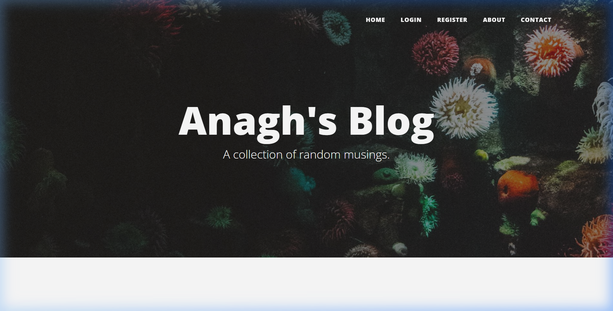

# Anagh's Blog

A full-featured, multi-user blog platform built with Flask, deployed on Render with a PostgreSQL database.

**Live Site:** [blog-app-drjh.onrender.com](https://blog-app-drjh.onrender.com/)



---

## Features

- **User Authentication** — Register, login, and logout with secure password hashing (PBKDF2 + SHA-256)
- **Blog CRUD** — Create, read, edit, and delete blog posts with a rich text editor (CKEditor)
- **Comment System** — Authenticated users can comment on posts with Gravatar profile pictures
- **Role-Based Access Control**
  - **Admin** (first registered user) — Can create new posts, delete any post
  - **Authors** — Can edit and delete only their own posts
  - **Registered Users** — Can view posts and leave comments
  - **Guests** — Can see the landing page, about, and contact pages
- **Contact Form** — Sends messages directly via Gmail SMTP
- **Responsive Design** — Bootstrap 5 with clean, modern UI

## Tech Stack

| Layer | Technology |
|-------|-----------|
| **Backend** | Flask 2.3, Python 3.11 |
| **Database** | PostgreSQL (production) / SQLite (local dev) |
| **ORM** | SQLAlchemy 2.0 with Flask-SQLAlchemy |
| **Auth** | Flask-Login + Werkzeug password hashing |
| **Forms** | Flask-WTF + WTForms |
| **Rich Text** | Flask-CKEditor |
| **Frontend** | Bootstrap 5 (Bootstrap-Flask) |
| **Avatars** | Flask-Gravatar |
| **Server** | Gunicorn (WSGI) |
| **Hosting** | Render (Web Service + PostgreSQL) |

## Project Structure

```
Blog_Project/
├── main.py              # Flask app, routes, models, and business logic
├── forms.py             # WTForms form classes
├── requirements.txt     # Python dependencies
├── Procfile             # Gunicorn start command for deployment
├── render.yaml          # Render Blueprint (infrastructure-as-code)
├── .env                 # Environment variables (not tracked in git)
├── .gitignore           # Git ignore rules
├── static/
│   ├── assets/img/      # Background images
│   ├── css/             # Stylesheets
│   └── js/              # JavaScript files
└── templates/
    ├── header.html      # Navbar and head (shared)
    ├── footer.html      # Footer with social links (shared)
    ├── index.html       # Homepage — post listing
    ├── post.html        # Individual post view with comments
    ├── make-post.html   # Create / edit post form
    ├── login.html       # Login page
    ├── register.html    # Registration page
    ├── about.html       # About page
    └── contact.html     # Contact form page
```

## Getting Started

### Prerequisites

- Python 3.9+
- pip

### Local Setup

1. **Clone the repository**
   ```bash
   git clone https://github.com/anagh-guptaa/blog-platform.git
   cd blog-platform
   ```

2. **Create a virtual environment**
   ```bash
   python -m venv venv
   source venv/bin/activate        # macOS/Linux
   venv\Scripts\activate           # Windows
   ```

3. **Install dependencies**
   ```bash
   pip install -r requirements.txt
   ```

4. **Set up environment variables**

   Create a `.env` file in the project root:
   ```env
   FLASK_SECRET_KEY=your-secret-key-here
   MAIL_USERNAME=your-email@gmail.com
   MAIL_PASSWORD=your-gmail-app-password
   ```

   > **Note:** For Gmail SMTP, you need to generate an [App Password](https://support.google.com/accounts/answer/185833) from your Google Account settings.

5. **Run the app**
   ```bash
   python main.py
   ```
   The app will be available at `http://localhost:5002`

   > SQLite is used automatically for local development — no database setup required.

## Deployment

This project is configured for one-click deployment on [Render](https://render.com) using the included `render.yaml` Blueprint.

### Deploy to Render

1. Push your code to GitHub
2. Go to [Render Dashboard](https://dashboard.render.com) → **New** → **Blueprint**
3. Connect your GitHub repo — Render reads `render.yaml` and creates:
   - A **Web Service** (free tier)
   - A **PostgreSQL Database** (free tier)
4. Set the environment variables when prompted:
   - `MAIL_USERNAME` — Your Gmail address
   - `MAIL_PASSWORD` — Your Gmail app password
5. Click **Deploy Blueprint** — done!

### Environment Variables (Production)

| Variable | Description | Auto-configured? |
|----------|-------------|:---:|
| `DATABASE_URL` | PostgreSQL connection string | Yes (by Render) |
| `FLASK_SECRET_KEY` | Session encryption key | Yes (auto-generated) |
| `MAIL_USERNAME` | Gmail address for contact form | No (set manually) |
| `MAIL_PASSWORD` | Gmail app password | No (set manually) |

## Database Schema

```
┌──────────────┐     ┌──────────────┐     ┌──────────────┐
│    users     │     │  blog_posts  │     │   comments   │
├──────────────┤     ├──────────────┤     ├──────────────┤
│ id (PK)      │◄──┐ │ id (PK)      │◄──┐ │ id (PK)      │
│ email        │   │ │ author_id(FK)│──┘ │ text         │
│ password     │   │ │ title        │     │ author_id(FK)│──► users
│ name         │   │ │ subtitle     │     │ post_id (FK) │──► blog_posts
│              │   └─│ date         │     │              │
│              │     │ body         │     └──────────────┘
│              │     │ img_url      │
└──────────────┘     └──────────────┘
```

## Author

**Anagh Gupta** — [GitHub](https://github.com/anagh-guptaa) | [LinkedIn](https://www.linkedin.com/in/anagh-gupta-8924b0283/)

## License

This project is open source and available for personal use and learning purposes.
